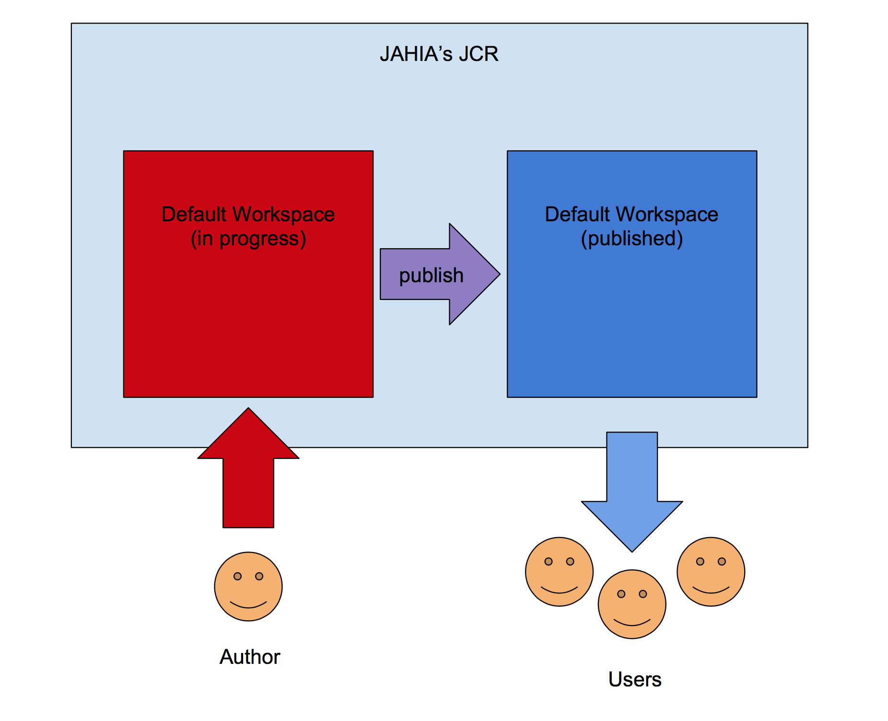
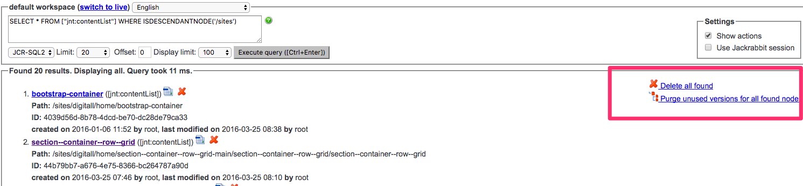

# Jahia's JCR

Jahia utilizes a hierarchical database to store its data, the name of the JCR implementation is called Apache Jackrabbit, you may give it a look before continuing reading by following the link below:

http://jackrabbit.apache.org/jcr/index.html

You should already be familiar with the tree structure of a JCR. What you may not be aware is that  the repository may have more than one workspace. Each workspace may have completely different contents and/or structure. Jahia stores its contents in two different workspaces, one is called the __default__ workspace and the other one is called the __live__ workspace.

Those two workspaces work in tandem to store work in progress content (default workspace) and already published content (live workspace): Authors will continue updating the __default__ content and when ready, they may publish their work (usually through a workflow) to the __live__ workspace.

</img>

The underlaying storage of the repository is done through a Relational Data Base, the default DB used is MySQL. You should not access the RDB unless something went very wrong and you know what you are doing. Keep the transactions and operations at the JCR level and be sure to know ways of sanitizing it without endangering the integrity of the repository.

# Jahias structured model

Jahia is more delicate than some other CMS that use a JCR for storage. The reason being not following David's Model (https://wiki.apache.org/jackrabbit/DavidsModel). 

If you follow David's model you learn to be very flexible about your structure. Data drives the structure and not the other way around. Unfortunately Jahia relies on having a proper structure from the start for each component created.

All of these means that when working with Jahia you'll encounter problems when _modifying_ a component that already has content and even worst, it may be already published. If you were to modify the project structure, some inconsistencies may occur in the repository, be aware of them.

# JCR Troubleshooting

## Deletion of a nodetype

_Issue_

Deletion of nodetypes could lead to a problem when importing/exporting content.

Even when the nodetype has been removed, previous content may still exist in the source instance. Thus, when exporting such site to another instance without the nodetype, the target instance won't know what to do with the imported content that has such nodetype.

_Solution_

Query for the nodetype definition you removed and remove from the content as well:

For example, imagine you want to remove the nodetype called __jnt:contentList__. First remove the nodetype from the project definition. Afterwards go to the __Jahia's Tools--> JCR Query Tool__ (http://localhost:8080/modules/tools/jcrQuery.jsp)

Then you will run the query to find all the content with the __jnt:contentList__ nodetype. Like the query below.

```sql
SELECT * FROM ["jnt:contentList"] WHERE ISDESCENDANTNODE('/sites')  
```

Afterwards, delete all nodes found by clicking that option on the top right link:

 

## Nodes being Locked

_Issue_ 

When starting workflows (as when publishing), some nodes may be locked. If the workflow fails, the node may stay lock and uneditable:

_Solution_

Access the JCR Browser (http://localhost:8080/modules/tools/jcrBrowser.jsp). 

Then find and remove the following properties from the locked node:

* j:lockTypes
* j:locktoken
* jcr:lockIsDeep
* jcr:lockOwner


## The __mandatory__ property.

_Issue_ 

The use of the __mandatory__ property may cause problems. Unless you really need to use it, avoid it. Try to handle missing properties during the rendering process instead of obliging the author to add them, Layer X should already handle this seamlessly, just be aware of it.

_First Solution_

In cases where a __mandatory__ property is added, but eventually won't be needed, make sure to keep the old property (by hiding it) instead of deleting it; since Jahia will expect the __mandatory__ property even though it has been removed (this could happen in the __default__ or __live__ workspace).

_Second Solution_ 

If you want to remove the property for good, you'll have to find the mandatory property in the JCR and remove __ALL__ instances of it. The problem is that even when no new instances of the component are created, when interacting when already created components, Jahia will expect the mandatory property when other operations are being conducted (like publishing).

Use the query tool once again (http://localhost:8080/modules/tools/jcrQuery.jsp) to find such property and remove it from your content.


## Repository desynchronization

_Issue_ 

If you are doing modifications on content which is already published, make sure to perform the changes on both repositories: live and default. Otherwise, you will create a desynchronisation that could block any publication of this content.

_Solution__

If you encounter a synchronization issue between workspaces, it is possible to fix it by exporting the site, reimporting it, and publishing it. 

