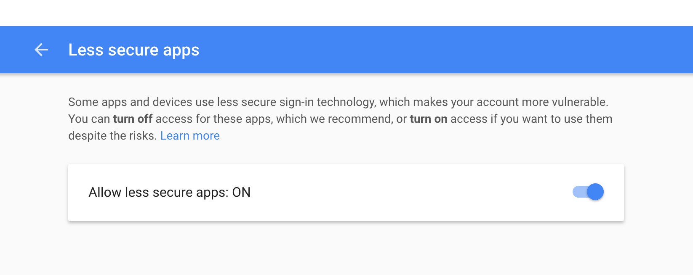

# How to send emails using JAHIA with gmail SMTP

First you will have to allow gmail to use less secure apps by following these steps:

## Allow less secure apps on Gmail

1. Go to the "Less secure apps" section.
https://myaccount.google.com/lesssecureapps?pli=1
2. Turn on the option __Allow less secure apps__   




Secondly, you may send emails using any Java API

Sending emails with javax.mail:

1. Create a servlet using spring:
https://github.com/Jahia/spring-servlet-osgi-module    
2. Connect to the SMTP server using the javax.mail.Authenticator API (or any other for that matter)

```
        final String username = "xumak.poc@gmail.com";
        final String password = "p4ssw0rd!!!";
		


        Properties props = new Properties();
        props.put("mail.smtp.auth", "true");
        props.put("mail.smtp.starttls.enable", "true");
        props.put("mail.smtp.host", "smtp.gmail.com");
        props.put("mail.smtp.port", "587");

        Session session = Session.getInstance(props,
          new javax.mail.Authenticator() {
            protected PasswordAuthentication getPasswordAuthentication() {
                return new PasswordAuthentication(username, password);
            }
          });  
          
```   

3. Send an email  

```
			Message message = new MimeMessage(session);
            message.setFrom(new InternetAddress("xumak.poc@gmail.com"));
            message.setRecipients(Message.RecipientType.TO,
                InternetAddress.parse(account));
            message.setSubject("Saludos");
            message.setText("Querido amigo,"
                + "\n\n Muchos saludos");

            Transport.send(message);
